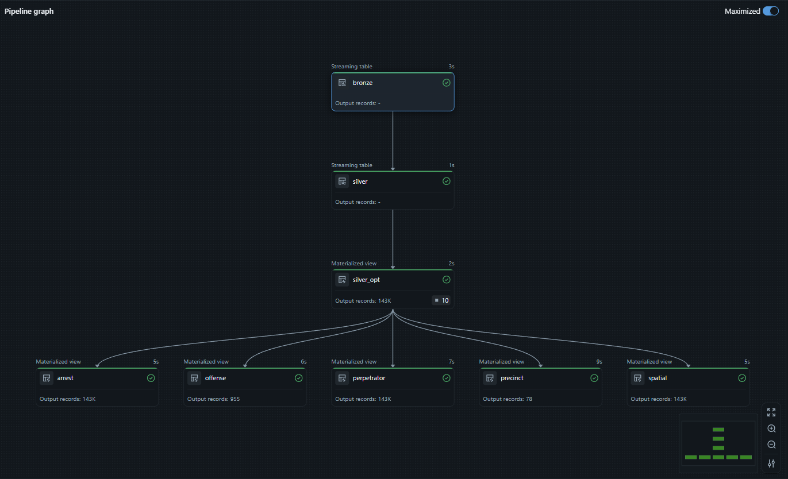

# Automated-Databricks-Lakeflow-Pipeline

# Automated Databricks Lakeflow Pipeline - NYPD Arrests Analytics 

## Description

Ce projet illustre un **pipeline automatisé avec Databricks Lakehouse Declarative Pipelines (DLT)** pour ingérer en **streaming** les données d’arrestations de la **NYPD des deux premiers trimestres 2025**.  

Le workflow suit la **Medallion Architecture** et utilise **Autoloader** pour l’ingestion depuis la couche **Landing** :

- **Bronze** : ingestion brute en streaming  
- **Silver** : nettoyage et standardisation  
- **Gold** : tables de faits et de dimensions relationnelles, prêtes pour l’analyse  

Chaque dataset comprend **19 colonnes clés**, couvrant les arrestations, infractions, contrevenants et coordonnées géographiques.  

Les tables Gold sont exposées via un **Databricks Serverless SQL Warehouse**, permettant une **intégration directe avec Power BI** pour créer des dashboards dynamiques et interactifs.

---

## Structure du projet

- **notebooks/** : tous les notebooks pour Bronze, Silver et Gold.  
- **docs/** : captures d’écran et visuels du projet. Exemple : ``  

---

## Tech Stack

- **Databricks Lakehouse Platform** : DLT, Autoloader, Delta Lake, Unity Catalog  
- **Power BI** : dashboards et visualisations  
- **SQL / Python / PySpark** : traitement et transformation des données  

---

## Objectifs du projet

- Montrer comment transformer des datasets bruts en **streaming** en un modèle analytique relationnel.  
- Appliquer des **bonnes pratiques de data engineering** : ingestion, nettoyage, standardisation, tables de faits et dimensions.  
- Fournir un pipeline **réutilisable, sécurisé et prêt pour l’analyse BI**.  

---

## Exemples de screenshots

---

## Notes

- Les notebooks contiennent la logique pour l’ingestion bronze, le nettoyage silver et la génération des tables gold.  
- Les tables gold respectent les **principes relationnels** et peuvent être utilisées directement pour des rapports Power BI.  

---

